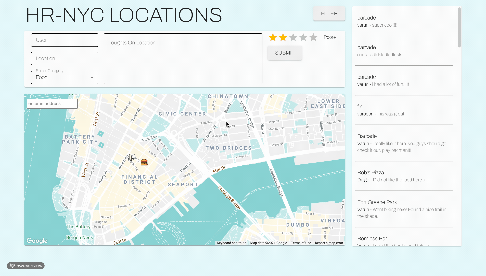

  <h1 align="center"><strong>HR-NYC LOCATIONS</strong></h1>

Locations is a single page application that is a location diary for you and your friends! HR-NYC Locations is a 2 day MVP passion project.

# Stack

<table>
  <tbody>
    <tr>
      <td>Frontend</td>
      <td>
        
        
        
        
        
      </td>
    </tr>
      <td>Backend</td>
      <td>
        
        
        
      </td>
    <tr>
      <td>Utilities</td>
      <td>
        
        
        
      </td>
    </tr>
  </tbody>
</table>

# Features
  * *Map*: A map that allows you to see what locations your friends reccomend
  * *Sorting Based On Category*: An easy to use sorting system that updates both the locations and the feed.
  * *Feed*: On the feed, see where your friends have been in NYC and see their thoughts.
  * *Location Entry*: Submit your thoughts on a lotaction you attended! Make sure to use the correct icon when marking an area!

      
      
      

# Build Project
Follow these steps to run the project in a mac or linux environment.
- Clone down the repo in the terminal
- Install dependencies - `npm install`
- Run server - `npm run server`
- It will be available on port 3000 - `http://localhost:3000/`